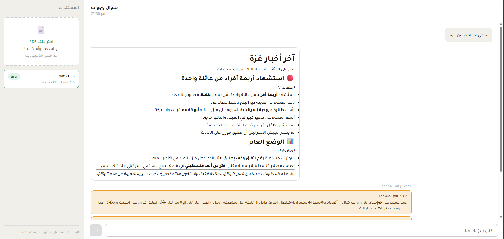

# Arabic PDF Q&A — سؤال وجواب

A RAG system that lets you upload Arabic PDFs and ask questions about them in Arabic — and get cited answers back in Arabic.

Most RAG demos are English-only. They don't handle right-to-left text, Arabic fonts, or multilingual embeddings. This one does.

---

## What it does

Upload a document — a research paper, a legal contract, a medical report, anything in Arabic. Ask a question. Get an answer that tells you exactly which page it came from.

No hallucination. The model only answers from what's actually in the document. If it can't find relevant content, it says so in Arabic instead of making something up.



---

## Why I built it

I wanted a RAG project that wasn't just another English PDF chatbot. Arabic is my native language, and there's a real gap in Arabic-language AI tooling — most of the ecosystem assumes English. Building this taught me how multilingual embeddings work, why RTL text needs special handling, and how to actually evaluate whether a retrieval system is doing its job.

---

## How it works

When you upload a PDF, the app:
1. Extracts the Arabic text using PyMuPDF
2. Splits it into overlapping chunks of ~500 tokens
3. Embeds each chunk using OpenAI's `text-embedding-3-large` — a multilingual model that maps Arabic and English to the same vector space
4. Stores the chunks and their embeddings in ChromaDB

When you ask a question:
1. The question gets embedded using the same model
2. ChromaDB finds the 3 most similar chunks using cosine similarity
3. Those chunks get sent to Claude as context with an Arabic system prompt
4. Claude answers in Arabic and cites which page it used

```
PDF upload → extract → chunk → embed → store in ChromaDB
                                              ↓
User question → embed → similarity search → top 3 chunks → Claude → cited answer
```

---

## Stack

| Layer | Tool |
|---|---|
| PDF extraction | PyMuPDF |
| Chunking | LangChain text splitter |
| Embeddings | OpenAI `text-embedding-3-large` |
| Vector store | ChromaDB |
| Generation | Claude API (claude-sonnet-4-6) |
| Backend | FastAPI |
| Frontend | React + Tajawal font |
| Deployment | Railway (backend) + Vercel (frontend) |

---

## Setup

**Requirements:** Python 3.10+, Node 18+

**Backend**

```bash
cd backend
python -m venv venv
venv\Scripts\activate      # Windows
source venv/bin/activate   # Mac/Linux
pip install -r requirements.txt
```

Copy `.env.example` to `.env` and fill in your keys:

```
OPENAI_API_KEY=your-key
ANTHROPIC_API_KEY=your-key
API_KEY=any-secret-string-you-choose
ALLOWED_ORIGIN=http://localhost:5173
```

Run the server:

```bash
uvicorn main:app --reload
```

**Frontend**

```bash
cd frontend
npm install
```

Create `.env.local`:

```
VITE_API_URL=http://localhost:8000
VITE_API_KEY=the-same-secret-string-from-backend
```

Run:

```bash
npm run dev
```

Open `http://localhost:5173`.

---

## Project structure

```
backend/
├── main.py                  # FastAPI app — wires everything together
├── core/
│   ├── config.py            # all settings from .env
│   └── models.py            # Pydantic response schemas
├── routers/
│   ├── upload.py            # POST /api/upload
│   └── query.py             # POST /api/query
└── services/
    ├── pdf_extractor.py     # PyMuPDF — Arabic text extraction
    ├── chunker.py           # LangChain — split into chunks
    ├── embedder.py          # OpenAI — embed chunks and queries
    ├── vector_store.py      # ChromaDB — store and search
    ├── retriever.py         # similarity search + threshold filtering
    ├── prompt_builder.py    # Arabic prompt formatting
    └── generator.py        # Claude API + token logging

frontend/
├── src/
│   ├── App.jsx
│   ├── api/client.js        # all fetch calls in one place
│   └── components/
│       ├── Sidebar.jsx      # upload zone + document list
│       ├── ChatArea.jsx     # messages + input
│       ├── MessageBubble.jsx
│       └── UploadZone.jsx
```

---

## What I learned from testing it

I ran 10 questions against a real Arabic newspaper PDF. Here's what I found:

**Retrieval worked well (8/10)** for content questions — political topics, named entities, direct factual questions. The multilingual embedding model handled Arabic naturally without any translation step.

**Two failures came from the PDF format, not the system.** Arabic newspaper PDFs use multi-column layouts that PyMuPDF doesn't fully reconstruct — a sentence that spans two columns sometimes gets split across chunks. The retrieval scores for these questions were lower (0.28–0.32 vs 0.45+ for successful ones), and the answers were less precise.

**The similarity threshold matters more than I expected.** I started at 0.5 and got no results on a legitimate question. After testing, 0.25 worked better for noisy newspaper text. A structured document (a clean research paper or contract) would probably work fine at 0.4+.

**What I'd improve next:**
- Add a reranking step — retrieve top 10 chunks, then use a second model to pick the best 3 before sending to Claude. This would help with the column-split problem.
- Switch to Pinecone for production so the vector store persists properly across deployments.
- Add streaming to the Claude response so the answer appears word by word instead of all at once after 2–3 seconds.

---

## Production considerations

A few things I added that most RAG tutorials skip:

- **Duplicate upload protection** — re-uploading the same file returns a 409 instead of silently doubling the chunks
- **Image-only PDF detection** — scanned PDFs return a clear error instead of storing empty chunks and giving nonsense answers
- **Similarity threshold fallback** — if no chunk scores above the threshold, the app returns an Arabic "I couldn't find enough information" message instead of hallucinating
- **Token logging** — every Claude API call logs input tokens, output tokens, and estimated cost so you always know what you're spending
- **API key protection** — both endpoints require an `X-API-Key` header
- **CORS from environment** — the allowed origin is set per-environment, not hardcoded

---

## Live demo

Backend: `https://arabic-pdf-qa-production.up.railway.app/health`  
Frontend: *(coming soon)*
